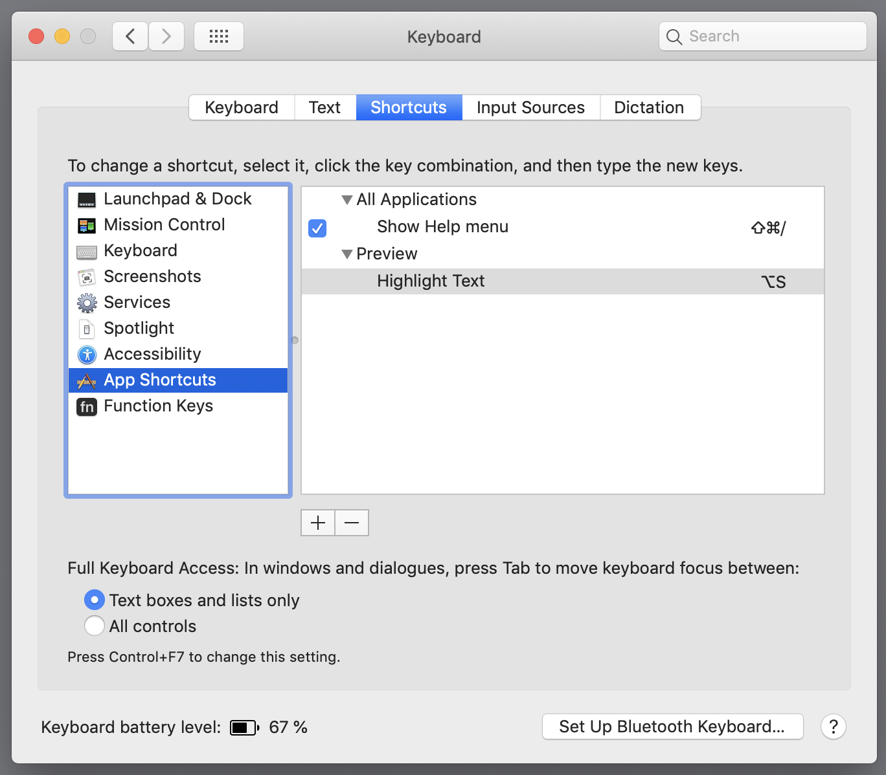
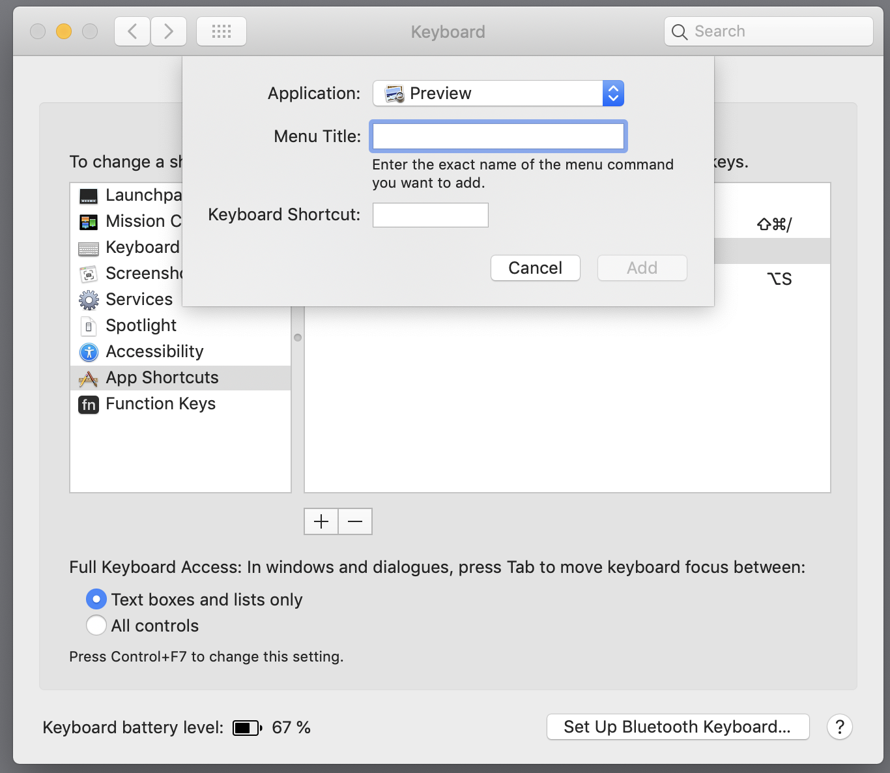

# Docs

### Changing app shortcuts in mac. E.g. Preview app for pdf's




[Changing the shortcut for highlighting text in Preview](https://apple.stackexchange.com/questions/208638/changing-the-shortcut-for-highlighting-text-in-preview)

---

# Cli

|                                                              |
| ------------------------------------------------------------ |
| [readings](##readings)                                       |
| [process & params](##process & params)                       |
| [Installing your cli locally](##Installing your cli locally) |
| [Oclif](##Oclif)                                             |

## readings

- [egghead cli from scratch](https://egghead.io/lessons/node-js-develop-and-publish-a-node-js-cli-from-scratch)
- [12 Factor CLI Apps](https://medium.com/@jdxcode/12-factor-cli-apps-dd3c227a0e46)
- [Rules for creating great developer CLIs
  ](https://devrel.net/developer-experience/rules-for-creating-great-developer-clis)
- [cli-cheatsheet](https://github.com/sw-yx/cli-cheatsheet)
- [Cli Workshop](https://github.com/sw-yx/egghead-cli-workshop)
- Workspaces
  - [Why Are You Still Using Yarn in 2018?](https://iamturns.com/yarn-vs-npm-2018/)
  - [Why Lerna and Yarn Workspaces is a Perfect Match for Building Mono-Repos – A Close Look at Features and Performance](https://doppelmutzi.github.io/monorepo-lerna-yarn-workspaces/)

---

## process & params

### process.argv

1. The node binary
2. The script being executed

```js
console.log(process.argv);
```

```
[
  '/usr/local/Cellar/node/12.6.0/bin/node',
  '/Users/pere.pages/Desktop/cli/cli.js'
]
```

#### parameters

```js
const params = process.argv.slice(2);
```

##### processing parameters with libraries

1. meow
2. arg
3. minimist
4. cliclopts

---

## Installing your cli locally

- [Node.js — How to test your new NPM module without publishing it every 5 minutes](https://medium.com/@the1mills/how-to-test-your-npm-module-without-publishing-it-every-5-minutes-1c4cb4b369be)
- [Understanding npm-link](https://medium.com/dailyjs/how-to-use-npm-link-7375b6219557)

```
npm i . -g
```

### run it

```bash
npx ppcli
# or
ppcli
# because we have specified at the top of our file: #!/usr/bin/env node
```

### link it instead of installing it

```bash
# being in the root folder of the repository
npm link
# results in:
# /usr/local/bin/ppcli -> /usr/local/lib/node_modules/ppcli/cli.js
# /usr/local/lib/node_modules/ppcli -> /Users/pere.pages/Desktop/cli
```

#### uninstall it

```bash
# being in the root folder of the repository
npm uninstall
```

---

## Oclif

In the branch oclif there's an example of how to create a _cli_ with **oclif**.

---

[WIKI](https://github.com/pearpages/docs/wiki)
