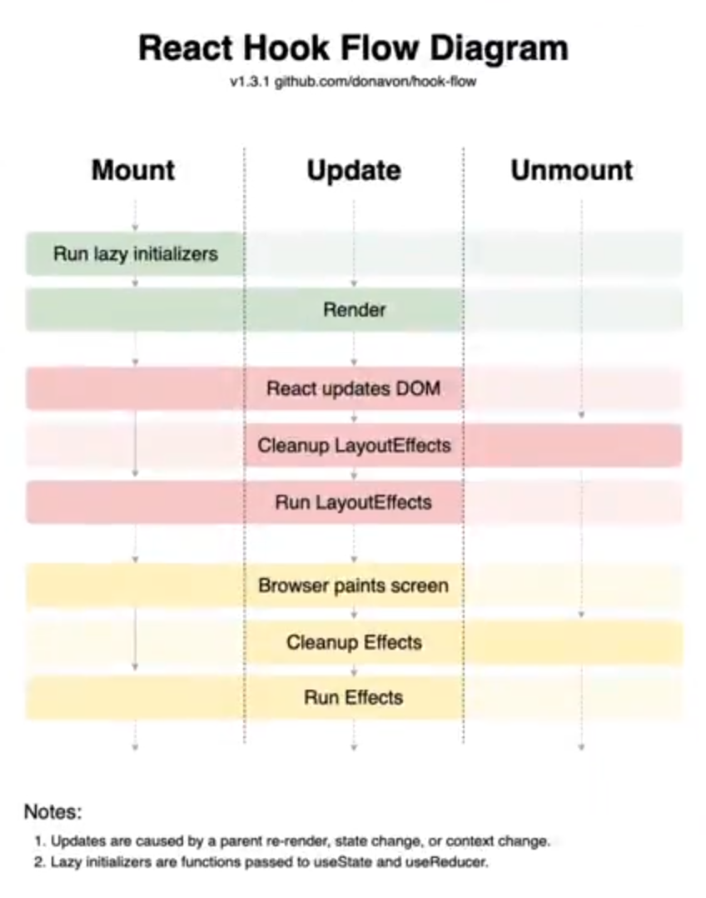

`Kent C Dodds published in egghead.io`

### DOM WAY

```js
const rootElement = document.getElementById("root");
const element = document.createElement("div");
element.textContent = "Hello world";
element.className = "container";
rootElement.appendChild(element);
```

### REACT WAY

> Import dependencies from cdn **https://unpkg.com**.
>
> - react
> - react-dom

```js
const rootElement = document.getElementById("root");
const element = React.createElement("div", {
  children: ["Hello World", "Goodbye World"],
  className: "container"
});
/*
you can also write it this way:
React.createElement("div", {className: "container"}, "Hello World", "Goodbye  World");

React.createElement(
  type,
  [props],
  [...children]
)
*/
ReactDom.render(element, rootElement);
```

### JSX

Using **unpkg.com**

`@babel/standalone`

```jsx
const rootElement = document.getElementById("root");
const children = "Hello World";
const element = <div className="container">{children}</div>;
/*
or
const element = <div className="container" children={children} />
*/
ReactDOM.render(element, rootElement);
```

#### Multiple Siblings

```js
const helloElement = React.createElement("span", null, "Hello");
const worldElement = React.createElement("span", null, "World");
const element = React.createElement(
  React.Fragment,
  null,
  helloElement,
  worldElement
);
ReactDOM.render(element, document.getElementById("root");
```

```jsx
<>
  <span>Hello</span>
  <span>World</span>
</>
```

### Component

```jsx
const message = ({ message }) => <div className="message">{message}</div>;
const message2 = ({ children }) => <div className="message">{children}</div>;

const element = (
  <div className="container">
    {message({ message: "Hello World" })}
    <Message message={"Hello World"} />
    <Message2>Hello World</Message2>
  </div>
);
```

```jsx
const rootElement = document.getElementById("root");
function Tick() {
  const getTime = () => new Date().toLocaleTimeString();
  return <div>{getTime()}</div>;
}

setInterval(() => ReactDOM.render(<Tick />, rootElement), 1000);
```

```jsx
<body>
  <style>
    .box {
      border: 1px solid black;
      box-sizing: border-box;
    }
    .box.box--small {
      width: 50px;
      height: 50px;
    }
    .box.box--medium {
      width: 150px;
      height: 150px;
    }
    .box.box--large {
      width: 300px;
      height: 300px;
    }
  </style>
  <div id="root"></div>
  <script type="text/babel">
    function Box({ className = "", style, size, children, ...rest }) {
      const sizeClassName = size ? `box--${size}` : "";
      return (
        <div
          className={`box ${className} ${sizeClassName}`}
          style={style}
          {...rest}
        >
          {children}
        </div>
      );
    }

    const rootElement = document.getElementById("root");
    const element = (
      <div>
        <Box size="small" style={{ backgroundColor: "lightblue" }}>
          small lightblue box
        </Box>
        <Box size="medium" style={{ backgroundColor: "pink" }}>
          medium pink box
        </Box>
        <Box size="large" style={{ backgroundColor: "orange" }}>
          large orange box
        </Box>
      </div>
    );
    ReactDOM.render(element, rootElement);
  </script>
</body>
```

### Setting State

```jsx
const rootElement = document.getElementById("root");
const state = { eventCount: 0, username: "" };

function App() {
  function handleClick() {
    setState({ eventCount: state.eventCount + 1 });
  }

  function handleChange(event) {
    setState({ username: event.target.value });
  }

  return (
    <div>
      <p>There have been {state.eventCount} events.</p>
      <p>
        <button onClick={handleClick}>Click Me</button>
      </p>
      <p>You tiped: {state.username}</p>
      <p>
        <input onChange={handleChange} />
      </p>
    </div>
  );
}

function setState(newState) {
  Object.assign(state, newState);
  renderApp();
}

function renderApp() {
  ReactDOM.render(<App />, rootElement);
}

renderApp();
```

```jsx
const rootElement = document.getElementById("root");

function Greeting() {
  const [name, setName] = React.useState("");

  const handleChange = event => setName(event.target.value);

  return (
    <div>
      <form>
        <label htmlFor="name">Name: </label>
        <input type="text" onChange={handleChange} id="name" />
      </form>
      {name ? <strong>Hello {name}</strong> : "Please type your name"}
    </div>
  );
}

function renderApp() {
  ReactDOM.render(<Greeting />, rootElement);
}

renderApp();
```

### Use Effect

```jsx
const rootElement = document.getElementById("root");

function Greeting() {
  const [name, setName] = React.useState(
    () => window.localStorage.getItem("name") || ""
  ); // use a function so it only runs it once, if we put a value it runs it on every render
  React.useEffect(() => window.localStorage.setItem("name", name)); // runs on every render
  const handleChange = event => setName(event.target.value);

  return (
    <div>
      <form>
        <label htmlFor="name">Name: </label>
        <input value={name} type="text" onChange={handleChange} id="name" />
      </form>
      {name ? <strong>Hello {name}</strong> : "Please type your name"}
    </div>
  );
}

function renderApp() {
  ReactDOM.render(<Greeting />, rootElement);
}

renderApp();
```

#### Effect dependencies

[eslint-plugin-react-hooks](https://www.npmjs.com/package/eslint-plugin-react-hooks)

```jsx
const rootElement = document.getElementById("root");

function Greeting() {
  const [number, setNumber] = React.useState(() => 0);
  const [name, setName] = React.useState(
    () => window.localStorage.getItem("name") || ""
  ); // use a function so it only runs it once, if we put a value it runs it on every render
  React.useEffect(() => window.localStorage.setItem("name", name), [name]); // runs on every render, BUT if we add the dependency array [name], it only runs when the dependency changes
  const handleChange = event => setName(event.target.value);
  const handleClick = _ => setNumber(number + 1);
  return (
    <div>
      <button onClick={handleClick}>{number}</button>
      <form>
        <label htmlFor="name">Name: </label>
        <input value={name} type="text" onChange={handleChange} id="name" />
      </form>
      {name ? <strong>Hello {name}</strong> : "Please type your name"}
    </div>
  );
}

function renderApp() {
  ReactDOM.render(<Greeting />, rootElement);
}

renderApp();
```

### Custom Hook

```jsx
const rootElement = document.getElementById("root");
function useLocalStorageState(key, defaultValue = "") {
  const [state, setState] = React.useState(
    () => window.localStorage.getItem(key) || defaultValue
  ); // use a function so it only runs it once, if we put a value it runs it on every render
  React.useEffect(() => window.localStorage.setItem(key, state), [key, state]); // runs on every render, BUT if we add the dependency array [name], it only runs when the dependency changes

  return [state, setState];
}

function Greeting() {
  const [number, setNumber] = React.useState(() => 0);
  const [name, setName] = useLocalStorageState("name");

  const handleChange = event => setName(event.target.value);
  const handleClick = _ => setNumber(number + 1);
  return (
    <div>
      <button onClick={handleClick}>{number}</button>
      <form>
        <label htmlFor="name">Name: </label>
        <input value={name} type="text" onChange={handleChange} id="name" />
      </form>
      {name ? <strong>Hello {name}</strong> : "Please type your name"}
    </div>
  );
}

function renderApp() {
  ReactDOM.render(<Greeting />, rootElement);
}

renderApp();
```

### ref, destroying useEffect and running it once

```jsx
// uses vanilla-tilt.js
function Tilt({ children }) {
  const tiltRef = React.useRef();

  React.useEffect(() => {
    const tiltNode = tiltRef.current;
    const vanillaTiltOptions = {
      max: 25,
      speed: 400,
      glare: true,
      "max-glare": 0.5
    };
    VanillaTilt.init(titlNode, vanillaTiltOptions);
    return () => {
      titltNode.vanillaTilt.destroy();
    }; // run when destroying (cleanup function)
  }, []); // only run once

  return (
    <div ref={tiltRef} className="tilt-root">
      <div className="title-child">{children}</div>
    </div>
  );
}
```

### Understanding when hooks get called



### Simple form

```jsx
function UserNameForm() {
  const usernameInputRef = React.useRef();
  function handelSubmit(event) {
    event.preventDefault();
    const username = event.target.elements.usernameInput.value;
    // const username = usernameInputRef.current.value;
  }
  return (
    <form onSubmit={handleSubmit}>
      <div>
        <label htmlFor="usernameInput">Username:</label>
        <input ref={usernameInputRef} name="usernameInput" type="text" />
      </div>
      <button type="submit">Submit</button>
    </form>
  );
}
```

### Form with state

```jsx
function UserNameForm() {
  const [username, setUsername] = React.useState("");
  const isLowerCse = username === username.toLowerCase();
  const error = isLowerCase ? null : "Username must be lower case";
  function handelSubmit(event) {
    event.preventDefault();
  }

  function handleChange(event) {
    setUsername(event.target.value);
  }
  return (
    <form onSubmit={handleSubmit}>
      <div>
        <label htmlFor="usernameInput">Username:</label>
        <input onChange={handleChange} name="usernameInput" type="text" />
      </div>
      <div style={{ color: "red" }}>{error}</div>
      <button disabled={Boolean(error)} type="submit">
        Submit
      </button>
    </form>
  );
}
```

#### Form with error message

```jsx
function UserNameForm() {
  const [username, setUsername] = React.useState("");
  const isLowerCse = username === username.toLowerCase();
  const error = isLowerCase ? null : "Username must be lower case";
  function handelSubmit(event) {
    event.preventDefault();
  }

  function handleChange(event) {
    setUsername(event.target.value);
  }
  return (
    <form onSubmit={handleSubmit}>
      <div>
        <label htmlFor="usernameInput">Username:</label>
        <input onChange={handleChange} name="usernameInput" type="text" />
      </div>
      <div style={{ color: "red" }}>{error}</div>
      <button disabled={Boolean(error)} type="submit">
        Submit
      </button>
    </form>
  );
}
```

#### Form with input filtering

```jsx
function UserNameForm() {
  const [username, setUsername] = React.useState("");

  function handelSubmit(event) {
    event.preventDefault();
  }

  function handleChange(event) {
    setUsername(event.target.value.toLowerCase());
  }
  return (
    <form onSubmit={handleSubmit}>
      <div>
        <label htmlFor="usernameInput">Username:</label>
        <input
          onChange={handleChange}
          name="usernameInput"
          type="text"
          value={username}
        />
      </div>
      <button type="submit">Submit</button>
    </form>
  );
}
```

## Error Boundaries

Errors that are happening within the React callstack like render or useEffect.

It's recommendable to use a library like `ErrorBoundary`.

```js
const ErrorBoundary = ReactErrorBoundary.ErrorBoundary;
```

This is an example of how manually do it (not recommended):

```jsx
class ErrorBoundary extends React.Component {
  state = { error: null };
  static getDerivedStateFromError(error) {
    return { error };
  }
  render() {
    const { error } = this.state;
    if (error) {
      return <this.props.FallbackComponent error={error} />;
    }
    return this.props.children;
  }
}
function ErrorFallback({ error }) {
  return (
    <div>
      <p>Something went wrong:</p>
      <pre>{error.message}</pre>
    </div>
  );
}
```

## Move the state to the least common component

```jsx
function Name({ name, onNameChange }) {
  return (
    <div>
      <label>Name: </label>
      <input value={name} onChange={onNameChange} />
    </div>
  );
}

function FavoriteAnimal({ animal, onAnimalChange }) {
  return (
    <div>
      <label>Favorite Animal: </label>
      <input value={animal} onChange={onAnimalChange} />
    </div>
  );
}

function Display({ name, animal }) {
  const animalText = animal ? `, you favurite animal is ${animal}` : "";
  return <div>{`Hey ${name}${animalText}`}</div>;
}

function App() {
  const [name, setName] = React.useState("");
  const [animal, setAnimal] = React.useState("");
  return (
    <form>
      <Name name={name} onNameChange={event => setName(event.target.value)} />
      <FavoriteAnimal
        animal={animal}
        onAnimalChange={event => setAnimal(event.target.value)}
      />
      <Display name={name} animal={animal} />
    </form>
  );
}

ReactDOM.render(<App />, document.getElementById("root"));
```

## Http

```jsx
function PokemonInfo({ pokemonName }) {
  const [pokemon, setPokemon] = React.useState(null);

  React.useEffect(() => {
    if (!pokemonName) {
      return;
    }
    fetchPokemon(pokemonName).then(pokemonData => {
      setPokemon(pokemonData);
    });
  }, [pokemonName]); // only reruns if the input parameter changes

  if (!pokemonName) {
    return "Submit a pokemon";
  } else if (!pokemon) {
    return "...";
  } else {
    return <pre>{JSON.stringify(pokemon, null, 2)}</pre>;
  }
}

function App() {
  const [pokemonName, setPokemonName] = React.useState("");

  function handleSubmit(event) {
    event.preventDefault();
    setPokemonName(event.target.elements.pokemonName.value);
  }

  return (
    <div>
      <form onSubmit={handleSubmit}>
        <label htmlFor="pokemonName">Pokemon Name</label>
        <div>
          <input id="pokemonName" />
          <button type="submit">Submit</button>
        </div>
      </form>
      <hr />
      <PokemonInfo pokemonName={pokemonName} />
    </div>
  );
}

function fetchPokemon(name) {
  const pokemonQuery = `
    query ($name: String) {
      pokemon(name: $name) {
        id
        number
        name
        attacks {
          special {
            name
            type
            damage
          }
        }
      }
    }
  `;

  return window
    .fetch("https://graphql-pokemon.now.sh", {
      // learn more about this API here: https://graphql-pokemon.now.sh/
      method: "POST",
      headers: {
        "content-type": "application/json;charset=UTF-8"
      },
      body: JSON.stringify({
        query: pokemonQuery,
        variables: { name }
      })
    })
    .then(r => r.json())
    .then(response => response.data.pokemon);
}

ReactDOM.render(<App />, document.getElementById("root"));
```

### Dealing with Http Errors

```jsx
function PokemonInfo({ pokemonName }) {
  const [status, setStatus] = React.useState("idle");
  const [pokemon, setPokemon] = React.useState(null);
  const [error, setError] = React.useState(null);

  React.useEffect(() => {
    if (!pokemonName) {
      return;
    }
    setStatus("pending");
    fetchPokemon(pokemonName).then(
      pokemonData => {
        setStatus("resolved");
        setPokemon(pokemonData);
      },
      errorData => {
        setStatus("rejected");
        setError(errorData);
      }
    );
  }, [pokemonName]);

  if (status === "idle") {
    return "Submit a pokemon";
  } else if (status === "rejected") {
    return "Oh no...";
  } else if (status === "pending") {
    return "...";
  } else if (status === "resolved") {
    return <pre>{JSON.stringify(pokemon, null, 2)}</pre>;
  } else {
    throw new Error("undefined status");
  }
}

function App() {
  const [pokemonName, setPokemonName] = React.useState("");

  function handleSubmit(event) {
    event.preventDefault();
    setPokemonName(event.target.elements.pokemonName.value);
  }

  return (
    <div>
      <form onSubmit={handleSubmit}>
        <label htmlFor="pokemonName">Pokemon Name</label>
        <div>
          <input id="pokemonName" />
          <button type="submit">Submit</button>
        </div>
      </form>
      <hr />
      <PokemonInfo pokemonName={pokemonName} />
    </div>
  );
}

function fetchPokemon(name) {
  const pokemonQuery = `
        query ($name: String) {
          pokemon(name: $name) {
            id
            number
            name
            attacks {
              special {
                name
                type
                damage
              }
            }
          }
        }
      `;

  return window
    .fetch("https://graphql-pokemon.now.sh", {
      // learn more about this API here: https://graphql-pokemon.now.sh/
      method: "POST",
      headers: {
        "content-type": "application/json;charset=UTF-8"
      },
      body: JSON.stringify({
        query: pokemonQuery,
        variables: { name }
      })
    })
    .then(r => r.json())
    .then(response => response.data.pokemon);
}

ReactDOM.render(<App />, document.getElementById("root"));
```

## ReactDevTools

Selecting a component if you go to a console you can use `$r`to see the hooks of the selected component.

The same applies when selecting an element in the debug console and using `$0`.
