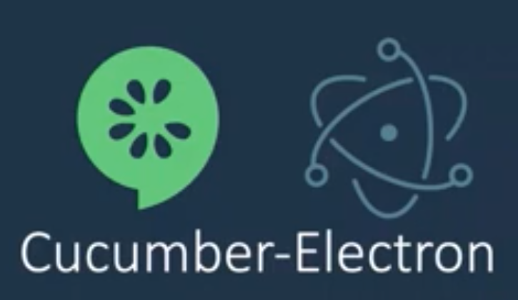

# Smartbear Webinar

[BDD with Cucumber.js, Cucumber-Electron and CrossBrowserTesting](https://smartbear.com/resources/webinars/bdd-cucumberjs-cucumber-electron-cbt/?utm_medium=email&utm_source=webreplay&utm_campaign=bdd-cucumberjs-cucumber-electron-cbt&mkt_tok=eyJpIjoiTVRVMFpqZGpNR001WkRRNCIsInQiOiJYdTFUc3lvbk9LVzlYaXNKV1JWRUUxSGJsV2RlZDJWXC9kUlpBTUY4NHRhYzJjXC9vWUNwZFhMVEgrT1wvNFBXQ1VtcWFnK1wvMG4xRlJ4eHllZzBraVlsMk40T1BaSXUrcnU2VzNqUXUrVFMrcnUxQUJtZ0tGSEY1TmFSSnQrN2dNU0QifQ%3D%3D)

> **Smartbear** are contributors to the **cucumber-js** project

1. Product  Overview
2. Gherkin scenarios and step definitions
3. Direct automation at the domain layer with **Cucumber.js**
4. In-process UI automation using **Cucumber-electron**
5. Augmenting the BDD process with CrossBrowserTesting
6. Live Demo
7. Q&A

> **Smartbear connect** smartbear.com/connect *27-28 April*

## Human percecption and response times


> **Full convidence** is slow

## cucumber-electron

[https://github.com/cucumber/cucumber-electron](https://github.com/cucumber/cucumber-electron)

> Runs cucumber-js in an electron renderer process. Scenarios have direct access to both a browser DOM and node.js libraries, so they are fast and easy to debug interactively.




Cucumber-electron runs cucumber-js in Electron, a framework for building desktop applications in web technologies. **By running features this way, your step definitions can require npm modules including server-side libraries and node.js core modules and use a browser DOM to render HTML, all in the same (chromium renderer) process, with no transpile step**.

This approach is a compelling alternative to using a frameworks like Selenium WebDriver, which automate real browsers like Chrome and Firefox, or even tools like PhantomJS which automate a headless virtual browser. **Because there is only one process, scenarios run much faster and debugging failures is significantly simpler**. It's also possible to write synchronous step definitions for manipulating and asserting about the DOM, which tend to be more reliable and easier to write than their asynchronous equivalents. Finally, cucumber-electron can be launched in "headed mode" and the familiar chromium developer tools can be used for interactive debugging of your web app.

[Demo](https://github.com/cucumber/todo-react-typescript-subsecond)

```
Feature: Todo

    Sceenario: Create Todo
      Given there is already 1 todo
      When Sam adds "get milk"
      Then Sam should see "get milk" at the top
    
    Scenario: Create Todo II
      Given there are already 2 todos
      When Some adds "get milk"
      Then Sam should see "get milk" at the thop
```

