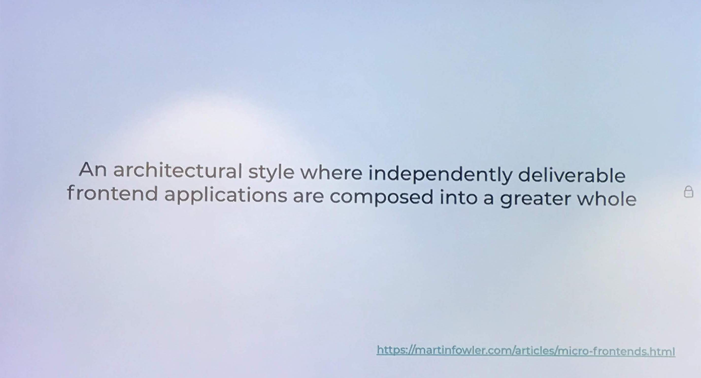
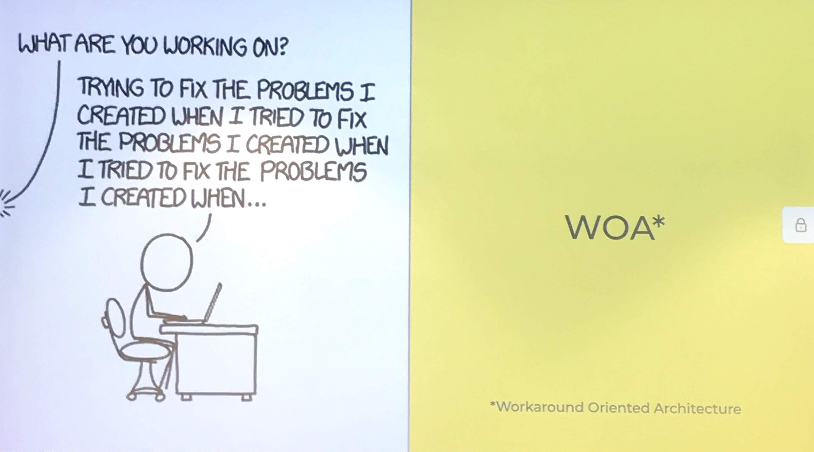
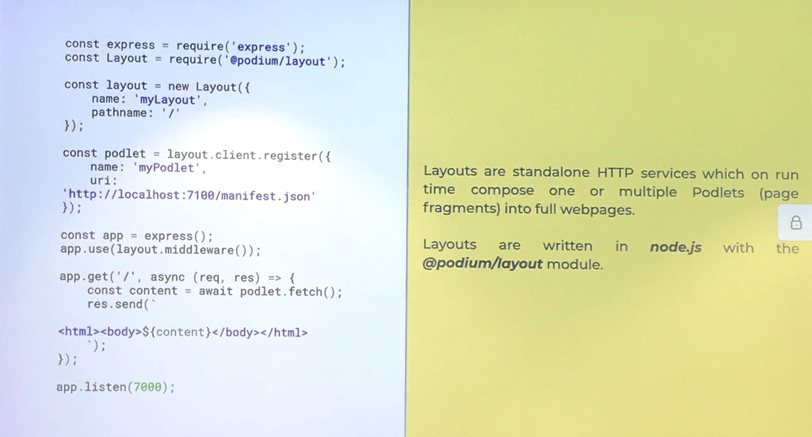
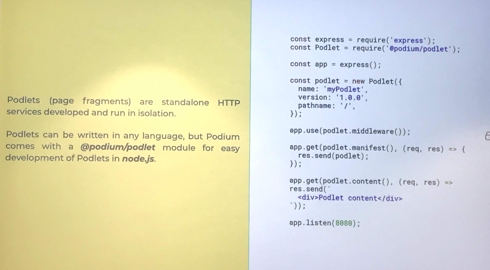
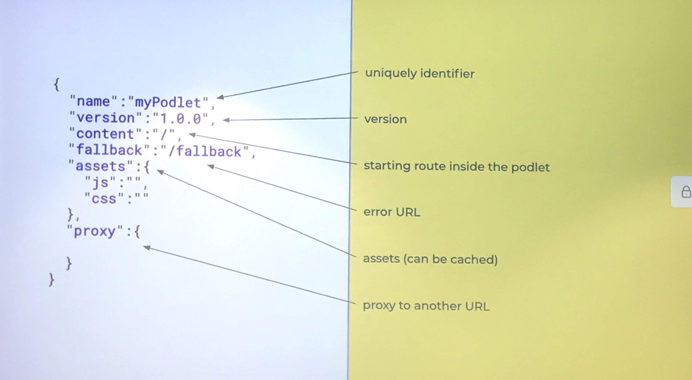
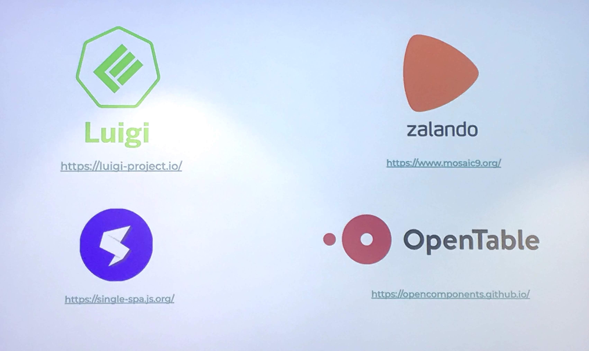
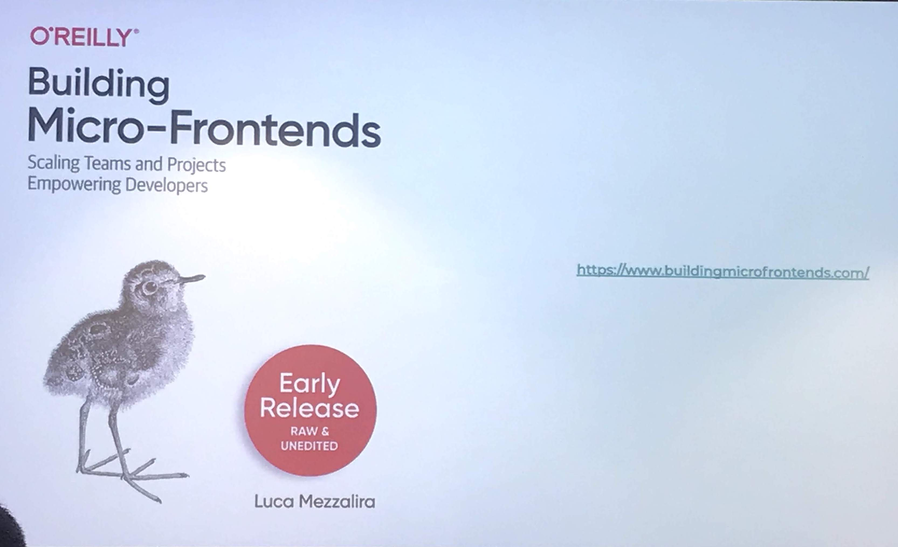

# Schibsted

| Resources                                                               |
| ----------------------------------------------------------------------- |
| [podium](https://podium-lib.io/)                                        |
| [Martin Fowler](https://martinfowler.com/articles/micro-frontends.html) |

## Definition

## Not defined architecture

## Schibsted library

## Code Examples and Concepts

- layout
- podlets
- configuration

### Layout

### Podlets

### Podlets Configuration

## Other Architectures

## More resources

