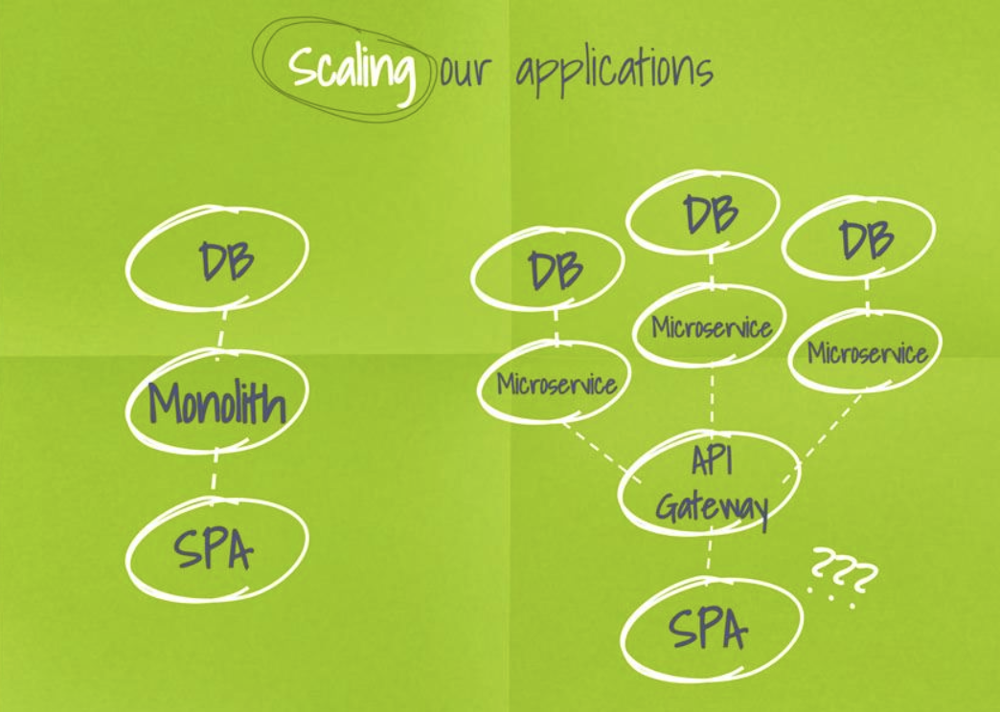
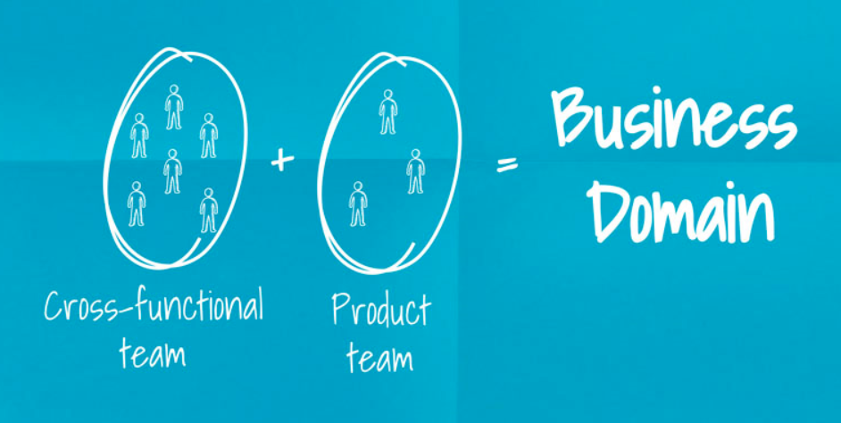
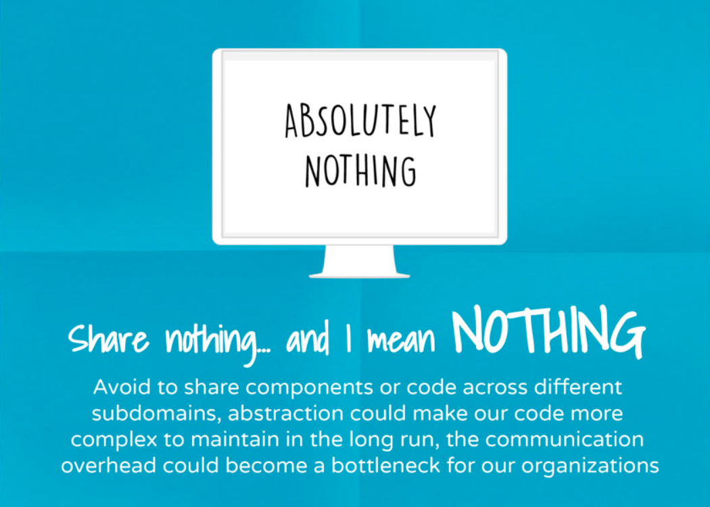
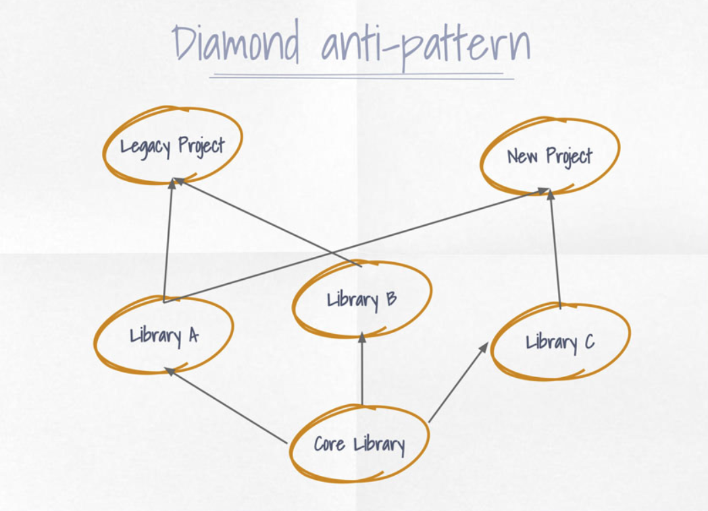
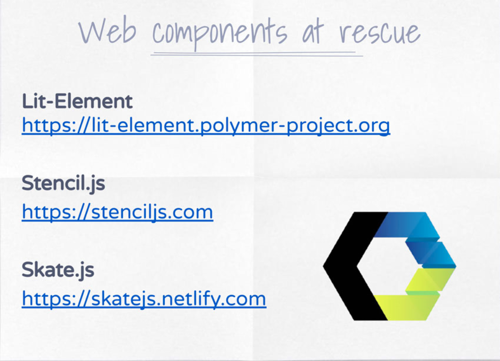
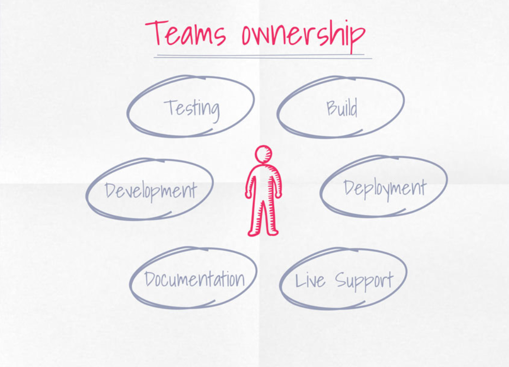
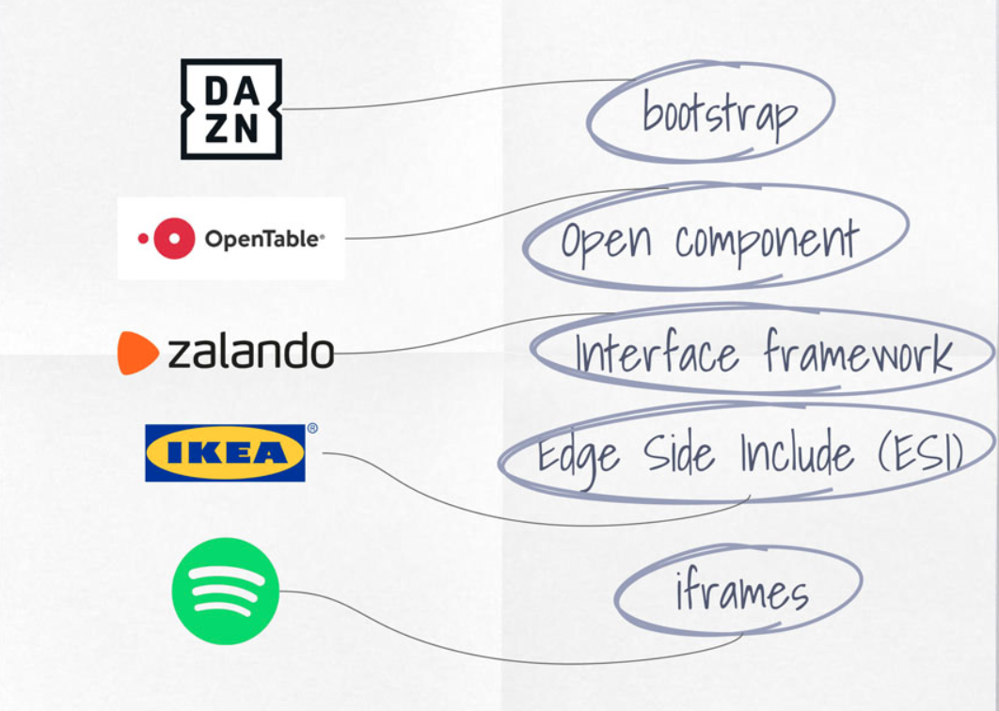
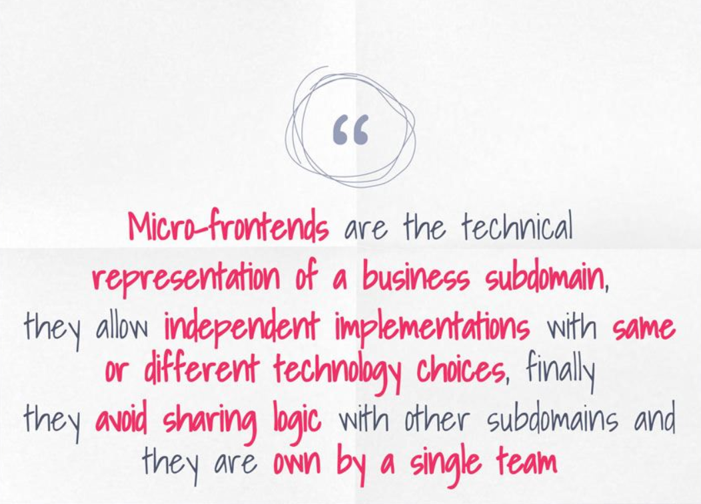

# 1.Introduction

It is an architecture, not an implementation.

## SPA vs SSR

### SPA (Single Page Application, e.g. REACT, Angular)

Load a single HTML page and dynamically update the page as the user interacts with the app. (lately there's been the improvement of splitting the js in chunks that lazy load)

|Pros|
|---|
| - unique codebase downloaded once|
| - usually the client is intelligent (fat client)|
| - no need to reload the page at any point|
| - "native experience" on certain devices|

|Cons|
| - if the application is complex could take long the first user interaction (tti)|
| - difficult to be indexed by crawlers |
| - complex handling a unique codebase in large and/or distributed teams in particular for multiple targets|

### SSR (Server Side Rendering, e.g. next.js, gatsby.js, Symfony, Express, Ruby on Rails, Django)

|Resources|
|---|
|[What’s Server Side Rendering and do I need it?](https://medium.com/@baphemot/whats-server-side-rendering-and-do-i-need-it-cb42dc059b38)|

> **Isomorphic Application** (also called *universal application*) are running the *code that usually runs on a client, in a server, **pre-rendering** the final result* so the client will be facilitated in the interpretation of that code.

|Pros|
| - less roundtrips to the server |
| - optimized for crawlers |
| - technology freedom (e.g. templating system, e.g. for different services)|
| - easier to optimise than SPA |

|Cons|
| - if content is not *cachable* the system could have *scability* challenges on the server side (e.g. highly personalized content) |
| - larger document size compared to SPAs |
| - slower time to first byte because the servers have to do more work |

> Can we have the best from those worlds? (rethorical question!)

-- WAIT FOR IT --

---

## POC

What we benefit the most are microservices, not only for *scaling* but for *people management* and have *adhoc* solutions. The right tool for the right job.

### But what in FE?

- Frontend uses the *same codebase* for all the teams
- *Communication overhead* for managing different part of the UI
- Infrastructure, Microservices and DBs almost autonomous in comparsion to the FE.

Divide the application in parts and knowing how to route those parts (microfrontends).

#### Impact within our teams

(*Divide and Conquer*)

1. End to end autonomy within a business domain
2. Freedom and responsibility
3. Innovation without affecting the entire application

## Business Subdomain

Flexibility of a startup inside an organization:

## Definition, what is a microfrontend

> *Micro-frontends* are the technical representation of a **business subdomain** (from Domain Driven Design DDD), they allow **independent implementations** with same or different technology choices, finally they avoid sharing logic with other subdomains and they are owned by a **single team**

## Domain and Subdomains (DDD)

|Resources|
|---|
|[DDD: Strategic Design: Core, Supporting, and Generic Subdomains](https://blog.jonathanoliver.com/ddd-strategic-design-core-supporting-and-generic-subdomains/)|

> **Domain** is the problem to be addressed with a software effort.

> A domain can be decomposed into **subdomains** which typically reflect some **organizational structure**

e.g. Netflix. Movies in any device (domain). Product catalog (subdomain).

### Subdomains

1. Core subdomain: why the company is doing what is doing.
2. Supporting subdomain: e.g. enriching user experience (third party for instance).
3. Generic subdomain: e.g. payment methods (paypal payment).

### How to identify your subdomains

Subdomains are easily identifiable in existing applications via **data**. Use e.g. *google analytics**.

In *green-field* or new feature projects subdomains are harder to recognize but not impossible.

Subdomains evolves alongside your business, iterate on them with the product teams or your customers.

> The **context** is very important and there is always a **trade off**

### Example DAZN

How the users interact using *google analytics*. It depends context by context.

1. Entry point (landing page) -single html page-
   1. generic subdomain
   2. spa, generated by a CMS
   3. highly cacheable with tiny payload
   4. a lot of traffic stops here
2. Onboarding
   1. Generic subdomain
   2. spa
   3. many permutations per market and device
   4. sign in, sign up, retrieve email, retrieve password and redeem gift
3. Discovery
   1. core subdomain
   2. spa
   3. video player, catalogue, search, sports data
   4. fast iterations with Product team considering it's the company's main focus
4. My Account
   1. Generic subdomain
   2. SPA
   3. Change user's details, payment methods, change application language...
5. Help
   1. Generic subdomain
   2. SPA
   3. Data retrieved by different CMS compared to landing pages
   4. This subdomain follows different rules than the others

---

## Technology independency

Having a clear idea what we have to build and how to do it. Frameworks are just an aid.

Tech independency is going to impact:

- best tech choice for the job
- hiring, retention and onboarding process
- building and deployment process
- company's standards
- developers morale

This gives freedom and independence to teams. You can use different technologies and try different and new things.

## Sharing nothing

> It is better to have some code duplication than a wrong abstraction!

### What about components or shared libraries?

Core library at the beginning helps a lot but in the long-term but they become detached and the secondary libraries tend to no wait the core library and that leads to discrepancies.

|Questions|
|---|
| - Who is responsible for the components or shared library? |
| - How fast can we make a change without affecting anyone else? |
| - Which technology are you going to use? why? |
| - How do you ensure fast iterations with distributed teams? |

## Web components at rescue

> Only use in recent browsers

|Resources|
|---|
|[Can I use](https://caniuse.com/)|
|[Webcomponents](https://webcomponents.org)|

|Concepts|
|---|
|Custom Elements (V1)|
|Shadow DOM (V1)|

## Teams ownership

Teams should be able to do an OWN. Empowered to do that.

- Development
- Testing
- Build
- Deployment
- Live Support
- Documentation

- A team can own 1 or multiple subdomains
- Team could contribute to other team's micro-frontends
- Sharing experience between teams can help the company's growth

## Why today and who uses micro-frontends

- **Large** organizations
- **Distributed** teams
- Fast iterations and releases
- Looking for technical teams independency
- Massive growth
- Aiming for the best technical quality

> First understand the domain and context, then move to micro-frontends. You do not need, neither might be good to start a green-field project with this structure.

> Micro-frontends useful in order to scale and release independently.

> +30 people working with the same codebase. Understanding the context and the maturity. Trade off!

> Communication is essential between micro-frontends (Auth tokens, etc.)

|Resources|
|---|
|[single-spa](https://single-spa.js.org/)|

## THE SLIDE

