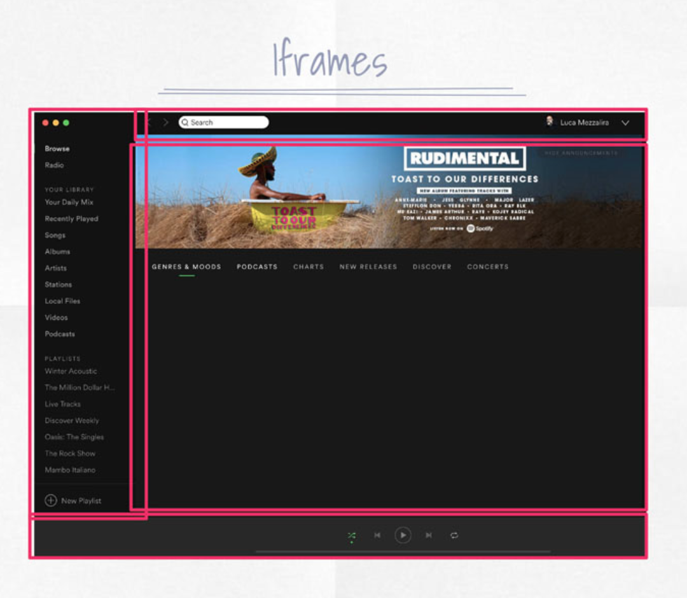
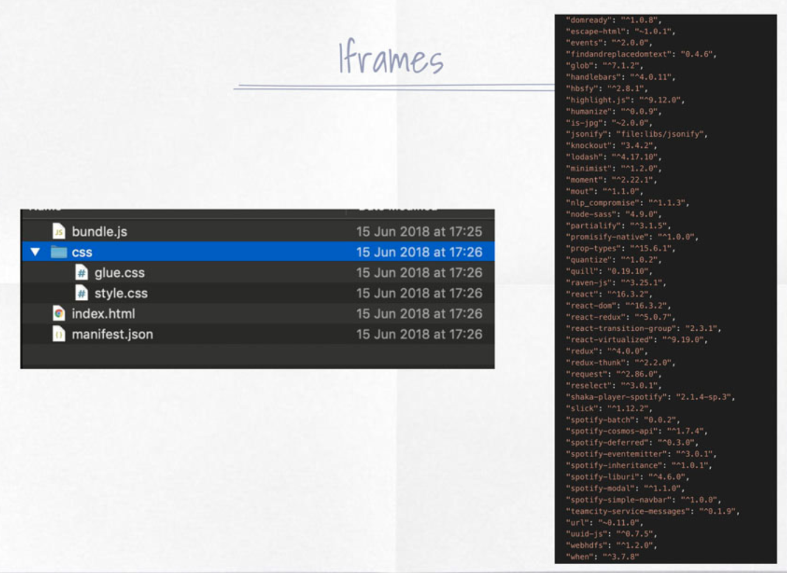
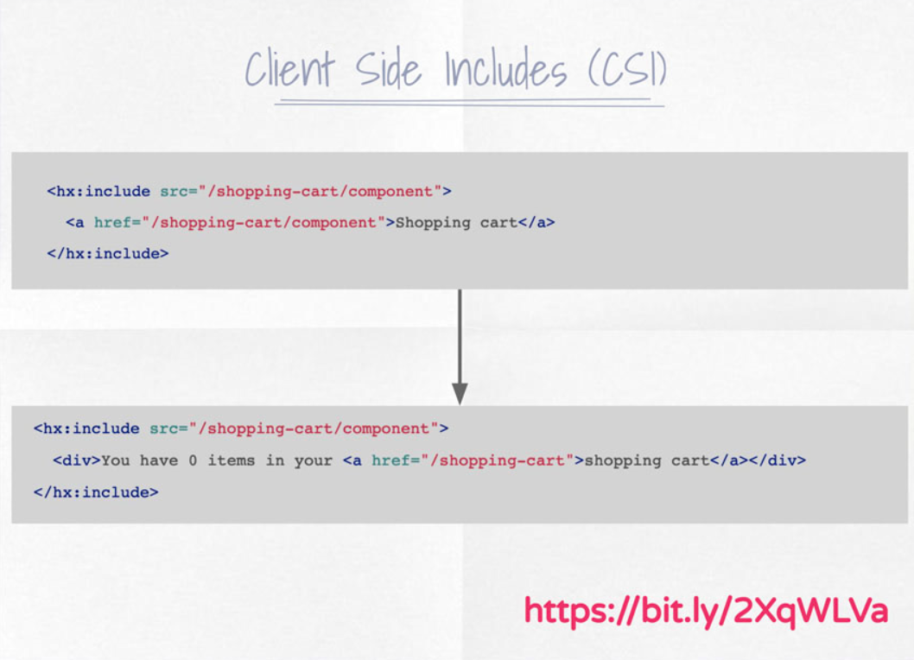

# Architectural Implementations

## Opentable

|Resources|
|---|
|[OpenTable](https://opencomponents.github.io/)|

Opentable developers experience team created Open Components, an open source project composed by a registry of components where frontend and backend logics are wrapped inside small, self contained units usable inside any view of their website.

OpenComponents is providing tools for quickly create new components like a CLI.

Everything is pre-rendered.

## Spotify

|Resources|
|---|
|[Building Spotify’s New Web Player](https://labs.spotify.com/2019/03/25/building-spotifys-new-web-player/)|
|[luigi](https://github.com/spotify/luigi)|

**Iframes**

An iframes composition is the choice made by *Spotify* with an event bus for coordinating the events across different iframes.

The desktop application mixes Web technologies with C++ codebase for the low-level operations.

Used in desktop.

## Zalando

|Resources|
|---|
|[mosaic](https://www.mosaic9.org/)|
|[front-end micro-services](https://jobs.zalando.com/en/tech/blog/front-end-micro-services/?gh_src=4n3gxh1%3Fgh_src%3D4n3gxh1)|

Zalando was one of the pioneers on micro-frontends with Mosaic9 in particular we need to highlight **Tailor.js**, an open source system for assembling the components on-demand on backend layer written in Go.

At the end of 2018 they are moving their implementation to a server-side include system called "Interface framework".

## IKEA

|Resources|
|---|
|[Transclusion](https://en.wikipedia.org/wiki/Transclusion)|
|[Edge Side Includes language](https://www.w3.org/TR/esi-lang)|
|[Micro­service Websites](https://gustafnk.github.io/microservice-websites/)|

### Edge Side Includes

Ikea embraces micro-frontends via *transclusion mechanism* via *Edge side Includes (aka ESI).

> **ESI** is a proposal made by several **CDN** companies in order to standarise the way you can compose frontend pages via transclusion. In this case the HTML page is composed on the edge allowing a dynamyc way for composing pages.

- The page is composed server-side transcluding HTML tags with external components.
- It's used at CDN level without a proper standard.

| Pros                                                                                | Cons                                                                                                 |
| ----------------------------------------------------------------------------------- | ---------------------------------------------------------------------------------------------------- |
| page created on the server at runtime and then cached if the content is not dynamic | with dynamic content is more difficult to cache the page response                                    |
|                                                                                     | if someone elements are hanging due to network issues, the response time could increase considerably |

### Client Side Includes (CSI) -Transclusion in the client-

- parsing the app DOM looking for elements to substitute
- lazy loading the component parsing an HTML document and replacing the content in App HTML
- it can be used in combination with ESI

| Pros                                                          | Cons                                  |
| ------------------------------------------------------------- | ------------------------------------- |
| Frictionless for developers                                   | harder to avoid bumping layouts       |
| Devs have full control on how to load part of the application | network failure strategy to implement |

## DAZN

"Bootstrap" is a shell with routing.

- Each Micro-frontends represents a subdomain matching the business structure
- It's technology/framework agnostic
- A micro-frontend is **autonomous**
- Inside a micro-frontend the team can share components, code, styles or any other asset
- Independent building systems
- 1 micro-frontend loaded per time
- 1 team own 1 micro-frontend

> They do not have multi-micro-frontends in the same view. Very similar to a SPA.

## Micro-frontend structure

You can have pure .js doing the index.html work.

- HTML
- CSS
- vendor vs app .js for the TTL of the cache

## Bootstrap

- loaded first element, always available
- tiny js layer responsible to load micro-frontends
- exposes APIs for different micro-frontends

It is very simple.

- DAZN object exposes methods and properties for all micro-frontends
- each micro-frontend has lifecycle callbacks available
- this object abstracts the platform exposing common APIs

### Components

- Components available on NPM **private** repos
- Components need to work with any framework
- They expose contract for the micro-frontend to interact with 
- Components are own by specific teams
- They can be shared within same time

## Single SPA

Similar to bootstrap.

It might take longer to TTI than an adhoc solution like DAZN bootstrap.

|Resources|
|---|
|[single-spa](https://single-spa.js.org/)|

- Each SPA reacts to lifecycle methods (mount/unmount and bootstrap)
- Framework agnostic, helpers available for major frameworks
- Single-spa-config with method for registering different SPAs

---

## Organizationally

- Very hard work defining the API
- Create mock responses

## Sharing state

They DON'T.

Just AuthToken and some parameters.

Micro-frontends must be independent.