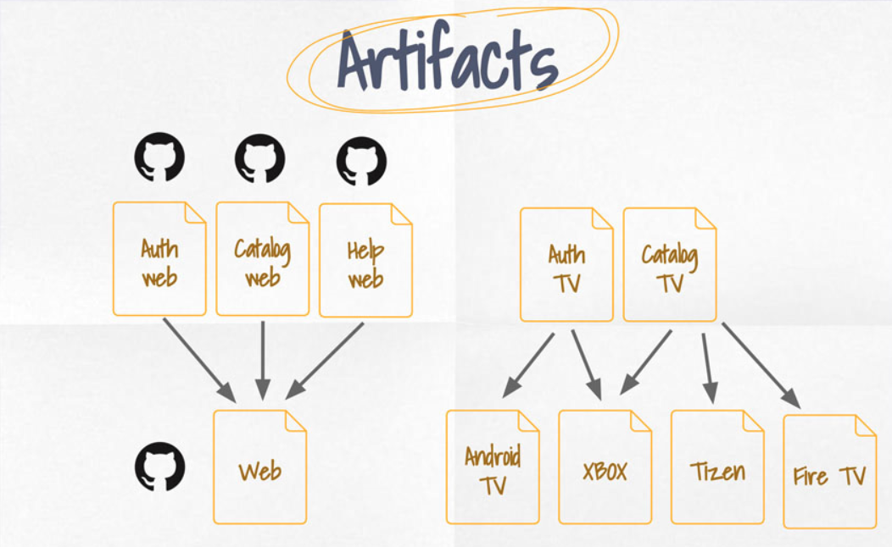

# Automation

> It is essential for **micro-frontends**.

- Fast feedback for developers
- Parallel jobs/steps execution
- Build an automation pipeline as code
- Easy to change and update any single step of any pipeline
- Innovation

## Tech decisions

- Tech stack
- Version control
- Testing strategy (unit, integration, e2e)
- Artifacts storage
- Deployment Strategy (canary-releases, big-bang)
- Additional automation checks(security, performance)

## Branching strategies

|Resources|
|---|
|[GitFlow vs Github Flow](https://lucamezzalira.com/2014/03/10/git-flow-vs-github-flow/)|

## Hot Fixes

## Artifacts

### Module Swapping

It's at compile time in combination with feature flags.

### Continous Integration

For building webpack or rollback.

## Deployment

|Resources|
|---|
|[Geo-routing, A/B testing and dynamic configuration with Lambda@Edge — part 1](https://medium.com/dazn-tech/https-medium-com-lucamezzalira-geo-routing-a-b-testing-and-dynamic-configuration-with-lambda-at-edge-c96999c26fe2)|
[[Amplify Framework](https://aws-amplify.github.io/)]

- based on some scenarios redirect the user to a version or another
- canary releases or blue green deployment on frontend

> **Canary release** is a technique that is used to reduce the risk of introducing a new software version in production by gradually rolling out the change to a small subgroup of users, before rolling it out to the entire platform/infrastructure and making it available to everybody.

> **Blue-green** deployment is a technique that reduces downtime and risk by running two identical production environments called Blue and Green. At any time, only one of the environments is live, with the live environment serving all production traffic. 

## Further Improvements

|Resources|
|---|
|[How To Think About Speed Tools](https://developers.google.com/web/fundamentals/performance/speed-tools/)|
|[webperf](http://www.webperf.net/)|
|[Optimization checklist](https://www.smashingmagazine.com/2020/01/front-end-performance-checklist-2020-pdf-pages/)|

- Lighthouse and webperf
- performance checks before deploying in production
- Optimization checklist