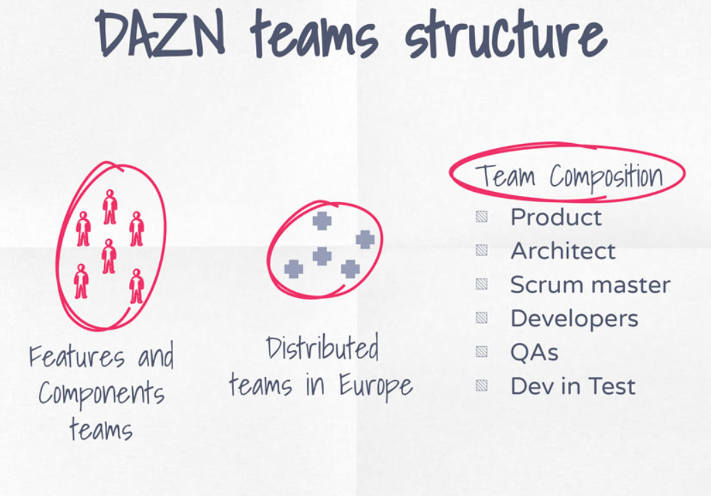

# Technical Implementations and Organizing Teams

| From                                | To                                                              |
| ----------------------------------- | --------------------------------------------------------------- |
| Technology decisions upfront        | Technology agnosticism                                          |
| reluctance of architectural changes | embracing changes and accomodate new architectural requirements |
| global coding style decisions       | team coding style and best practices definition                 |
| shared automation pipelines         | independent automation pipelines                                |
| ...                                 | acceptance of code duplication i favour of speed                |
| longer onboarding process           | easier hiring and onboarding                                    |
| ...                                 | innovation                                                      |

Not DAZN:

## Working by contract

- APIs are the first user interface of your application
- APIs come first, then the implementaion
- APIs are self-descriptive

Weeks spend before writing the code.

## SEO

| Resources                                                                                                                                                                                                                           |
| ----------------------------------------------------------------------------------------------------------------------------------------------------------------------------------------------------------------------------------- |
| [Google publishes documentation on dynamic rendering for crawling, indexing JavaScript webpages](https://searchengineland.com/google-publishes-documentation-on-dynamic-rendering-for-crawling-indexing-javascript-webpages-306171) |
| [Implement dynamic rendering](https://developers.google.com/search/docs/guides/dynamic-rendering)                                                                                                                                   |

| Standard Implmentation                                                                       | Dynamic Implementation                                                                   |
| -------------------------------------------------------------------------------------------- | ---------------------------------------------------------------------------------------- |
| Pay attention on how you render the content in your page (SSR over dynamic DOM manipulation) | Different website for GoogleBot using SRR for all the pages where(possible)              |
| When you use VDOM libraries rember the 5s rules                                              | Show immediately relevant content that is not available without user interaction         |
| Googlebot uses web rendering service based on Chrome 70 (recently updated)                   | Content available in those pages has to be the same for human version                    |
| Googlebot doesn't retain the state (no local or session storage available)                   | all the rules on the standard implementation are applicable to the dynamic rendering too |
| Key dom elements in light-DOM not shadowed DOM                                               | based on teh user-agent we serve the bot or human version                                |
| Load content when visible in the viewport and lazy laod the rest of your pages               | all the logic is wrapped in the lambda@edge                                              |
| Remember, ALL the requests are coming form USA                                               | automate the testing between different version to check the content is the same          |

## Main challenge

> The main challenges with **scaling** frontend applications are scaling **teams**, reducing the communication **overhead** and **innovate**!

## New Relic case Study

| "Born agile" --> growth! |
| ------------------------ |
| more dependencies        |
| higher friction          |
| higher frustration       |

|                                                        |                                                   |
| ------------------------------------------------------ | ------------------------------------------------- |
| Add process + oversight to manage complex dependencies | **Reduce dependencies to increase team autonomy** |

> **COMMUNICATION**

- Less/No dependencies shared across teams
- Speed of development
- End to end independence
- Ownership of their specific domain

### What are developers looking for?

- learning
- ownership
- innovation

### Te cost of replacing an employee

> Between 90% and 200% of one year salary of that employee

- cost of hiring
- cost of onboarding
- cost of learning and mastering domain
- cost of time with unfilled role

| Resources                                                                                                 |
| --------------------------------------------------------------------------------------------------------- |
| [The cost of losing employees](https://www.payscale.com/compensation-today/2017/12/cost-losing-employees) |
