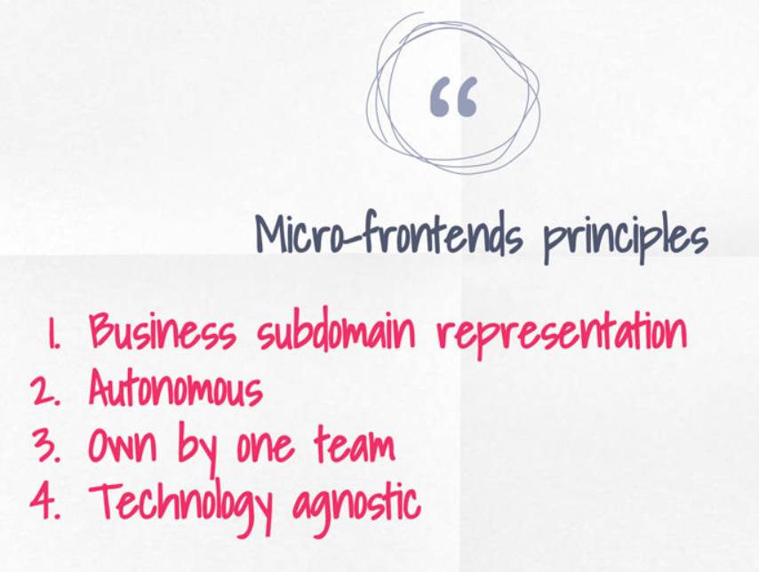
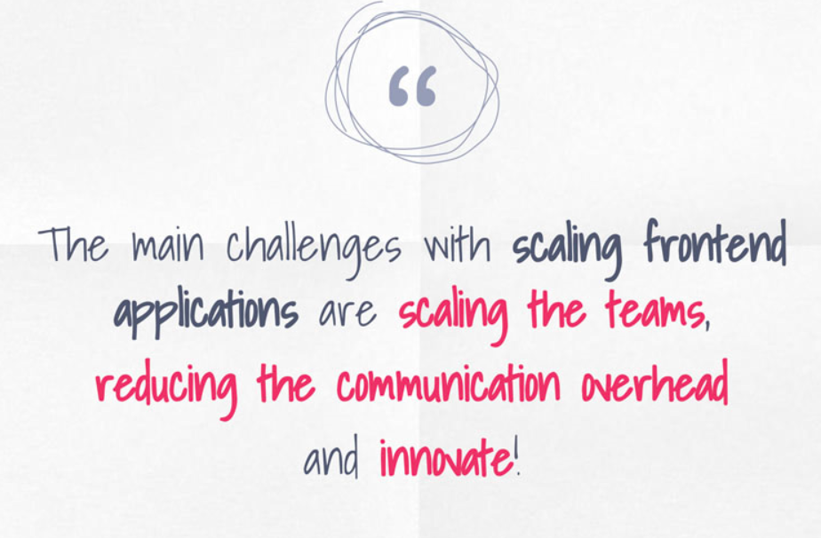
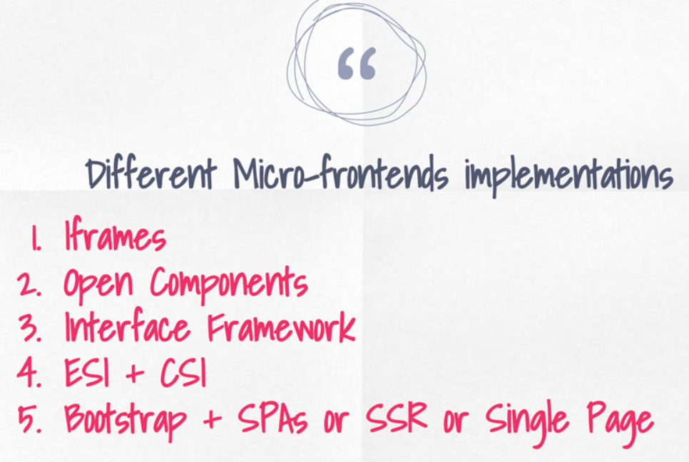
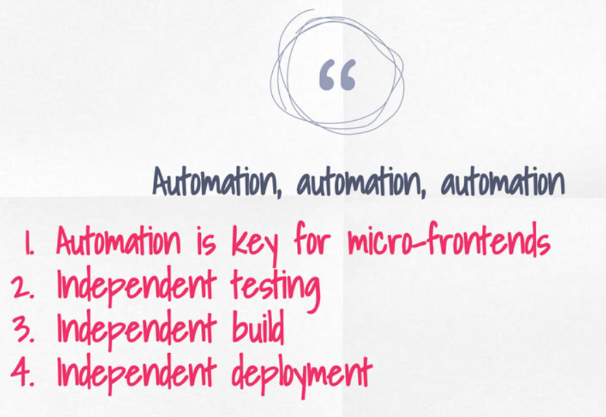
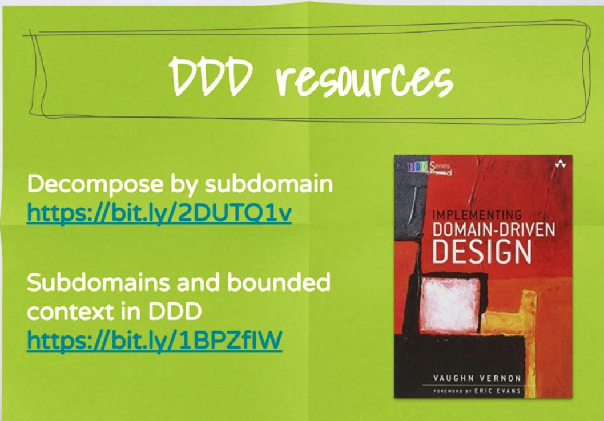

# Wrap Up

| Resources                                                                                                                                                             |
| --------------------------------------------------------------------------------------------------------------------------------------------------------------------- |
| [Pattern: Decompose by subdomain](https://microservices.io/patterns/decomposition/decompose-by-subdomain.html)                                                        |
| [Sub-domains and Bounded Contexts in Domain-Driven Design (DDD)](http://gorodinski.com/blog/2013/04/29/sub-domains-and-bounded-contexts-in-domain-driven-design-ddd/) |
| [single-spa](https://single-spa.js.org/)                                                                                                                              |
| [Micro­service Websites](https://gustafnk.github.io/microservice-websites/)                                                                                           |
| [project mosaic](https://www.mosaic9.org/)                                                                                                                            |
| [open components](https://github.com/opencomponents/oc)                                                                                                               |
| [Feature Hub](https://feature-hub.io/)                                                                                                                                |

